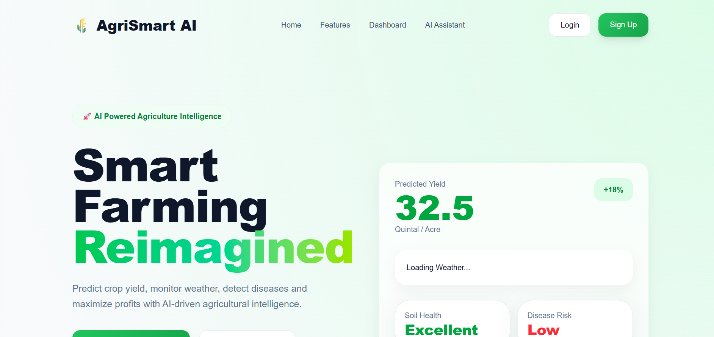
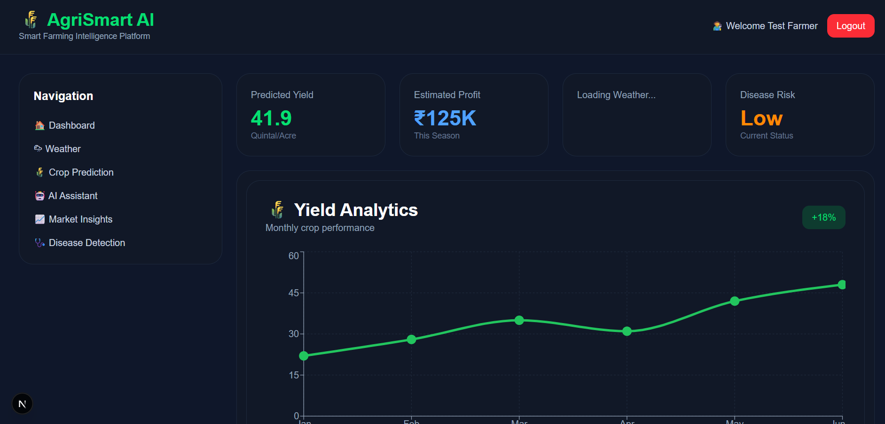
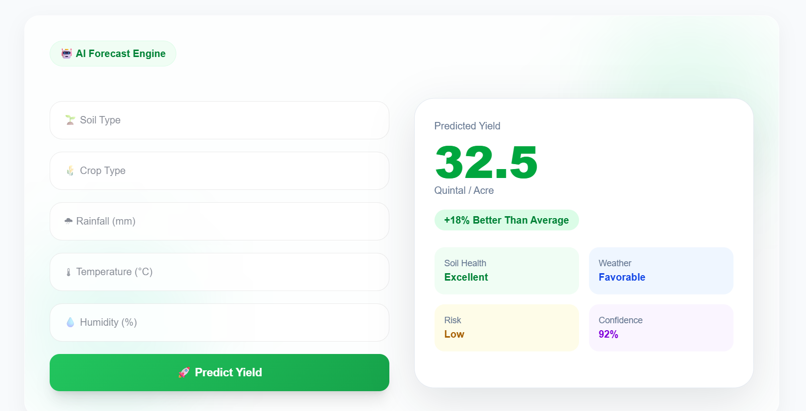
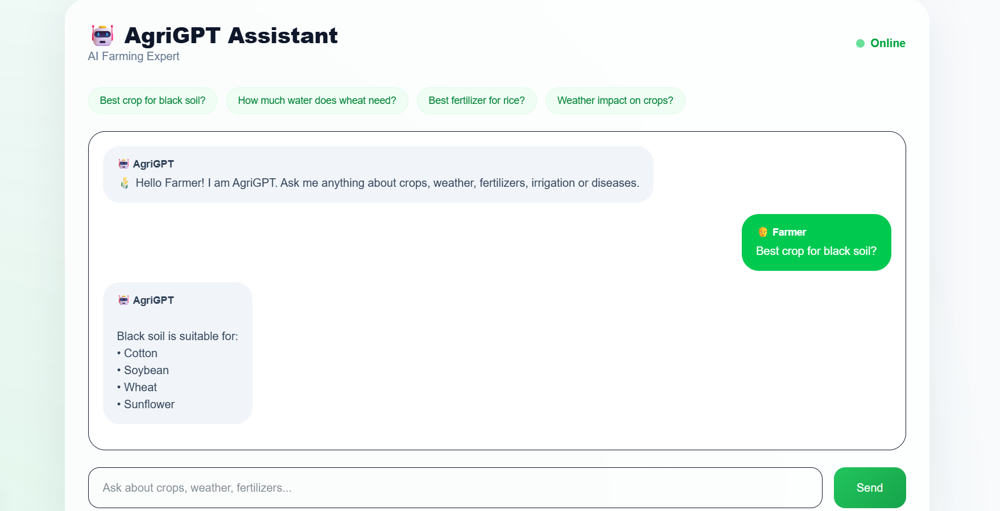
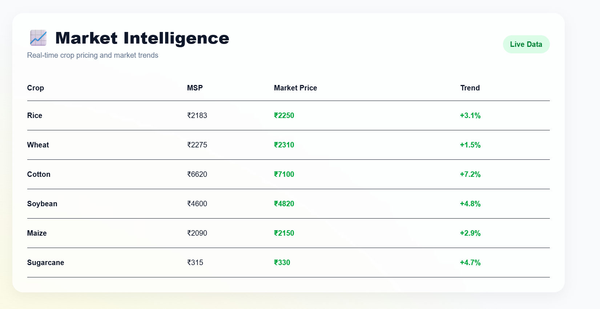

# 🌾 AgriSmart AI

### AI-Powered Smart Farming Intelligence Platform

AgriSmart AI is an intelligent farming platform that helps farmers make data-driven decisions using Artificial Intelligence, Machine Learning, Weather Intelligence, and Agricultural Analytics.

The platform assists farmers in crop planning, yield prediction, disease detection, weather monitoring, market analysis, and AI-powered agricultural guidance.

---

## 🚀 Problem Statement

Farmers often face challenges such as:

- Unpredictable weather conditions
- Crop diseases and pest attacks
- Improper crop selection
- Low productivity and yield losses
- Lack of access to agricultural experts
- Market price uncertainty

These issues directly impact productivity, profitability, and sustainability.

---

## 💡 Solution

AgriSmart AI provides a complete digital farming ecosystem that empowers farmers with real-time insights and AI-driven recommendations.

The platform offers:

- AI Crop Yield Prediction
- AI Crop Recommendation
- AI Farming Assistant
- Real-Time Weather Monitoring
- Market Insights Dashboard
- Smart Farming Analytics
- Disease Detection System

---

# ✨ Key Features

## 🌾 Crop Yield Prediction

Predict crop productivity based on:

- Soil Type
- Temperature
- Rainfall
- Humidity
- Fertilizer Usage
- Pesticide Usage

Provides estimated yield and farming insights.

---

## 🤖 AgriGPT Assistant

AI-powered farming assistant capable of answering:

- Crop selection queries
- Fertilizer recommendations
- Irrigation guidance
- Pest management questions
- Disease-related issues
- Weather-based farming advice

Powered by Google Gemini AI.

---

## 🌦 Weather Intelligence

Real-time weather monitoring including:

- Temperature
- Humidity
- Wind Speed
- Weather Conditions
- Farming Impact Analysis

Helps farmers plan agricultural activities effectively.

---

## 📈 Market Insights

Provides:

- Crop market trends
- MSP information
- Price fluctuations
- Demand analysis

Supports better selling decisions and profit maximization.

---

## 🌱 Crop Recommendation System

AI-based recommendation engine that suggests the most suitable crop based on:

- Soil conditions
- Weather conditions
- Environmental factors

Improves farming outcomes and profitability.

---

## 📊 Smart Dashboard

Interactive analytics dashboard displaying:

- Yield Predictions
- Weather Insights
- Market Trends
- Farming Analytics
- Crop Recommendations

---

# 🖼️ Project Screenshots

## Landing Page



---

## Dashboard



---

## Crop Prediction



---

## AI Assistant



---

## Market Insights



---

# 🛠️ Tech Stack

## Frontend

- Next.js
- React
- TypeScript
- Tailwind CSS

## Backend

- FastAPI
- Python

## Artificial Intelligence

- Google Gemini AI
- Machine Learning Models
- Predictive Analytics

## APIs

- OpenWeather API
- Gemini API

## Database

- SQLite
- PostgreSQL (Scalable Deployment)

---

# 🏗️ System Architecture

```text
Farmer
   │
   ▼
Frontend (Next.js + React)
   │
   ▼
FastAPI Backend
   │
   ├── Crop Prediction Model
   ├── Crop Recommendation Model
   ├── Gemini AI Assistant
   ├── Weather Intelligence
   ├── Market Analytics
   └── Disease Detection
```

# ⚙️ Installation

## Clone Repository

```bash
git clone https://github.com/ChitranshiPandey/smart-farming-ai.git

cd smart-farming-ai
```

## Backend Setup

```bash
cd backend

python -m venv venv

venv\Scripts\activate

pip install -r requirements.txt

uvicorn app.main:app --reload
```

Backend runs on:

```text
http://127.0.0.1:8000
```

---

## Frontend Setup

```bash
cd frontend

npm install

npm run dev
```

Frontend runs on:

```text
http://localhost:3000
```

---

# 📌 Future Enhancements

- Satellite Crop Monitoring
- Drone-Based Crop Analysis
- Voice-Based AI Assistant
- Multilingual Support
- Government Scheme Recommendation
- Carbon Credit Analysis
- Precision Farming Features
- IoT Sensor Integration

---

# 🌍 Impact

AgriSmart AI aims to:

- Improve crop productivity
- Reduce farming risks
- Enable early disease detection
- Increase farmer profitability
- Promote sustainable agriculture
- Make expert guidance accessible to all farmers

---

# 🏆 Hackathon Vision

AgriSmart AI transforms traditional agriculture into a smart, data-driven, and AI-powered ecosystem capable of supporting farmers with real-time intelligence and predictive decision-making.

---

# 👩‍💻 Developed By

**Chitranshi Pandey**

Smart Farming AI Project

Built for Innovation, Agriculture, and Sustainable Development 🌾